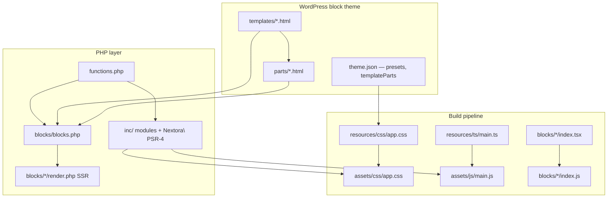

# Nextora

WordPress **block theme** (FSE): HTML templates under `templates/`, template parts under `parts/`, global styles in `theme.json` v3, plus first-party Gutenberg blocks in `blocks/`. Built with **Tailwind CSS v4**, **TypeScript**, **PHPStan**, and **PHPUnit**.

**For AI / Cursor agents:** [`AGENTS.md`](./AGENTS.md) — load order, build pipeline, hooks, and file conventions.

---

## Requirements

| Tool | Version |
|------|---------|
| WordPress | 6.4+ (see `style.css`) |
| PHP | 8.1+ |
| Node.js | 18+ |
| Composer | Optional at runtime; required for PHP tooling |

---

## Quick start

```bash
# From wp-content/themes/nextora/
composer install
npm install   # installs Husky pre-commit hook via "prepare"
npm run build
```

Git **pre-commit** (Husky) runs `lint-staged` (auto-fix staged PHP + TypeScript check when `.ts`/`.tsx` changed), then **`npm run lint:php:all`**. Skip once with `git commit --no-verify`. Dry-run: **`npm run precommit`**.

Activate **Nextora** under **Appearance → Themes**.

The theme runs without `vendor/`, but **compiled assets are required**. If `assets/css/app.css`, `assets/js/main.js`, or any `blocks/*/index.js` is missing, run `npm run build`.

During development:

```bash
npm run watch
```

Edit templates in **Appearance → Editor** (Site Editor). Default header/footer live in `parts/header.html` and `parts/footer.html`.

---

## Architecture

Nextora is a **block theme**: WordPress renders `templates/*.html` and `parts/*.html` directly. PHP in `inc/` and `blocks/*/render.php` adds behavior; compiled CSS/JS comes from `resources/`.



### Render flow

1. WordPress resolves a **block template** (`templates/single.html`, `templates/home.html`, …).
2. Templates include **template parts** via `<!-- wp:template-part {"slug":"header",…} /-->` (header/footer areas declared in `theme.json`).
3. **`nextora/header`** (default in `parts/header.html`) renders logo, nav, search, and optional WooCommerce utilities via `blocks/header/render.php`.
4. Other **dynamic theme blocks** SSR through their own `render.php`; editor scripts load from `blocks/<name>/index.js`.
5. **`inc/assets/assets.php`** enqueues global `assets/css/app.css` and `assets/js/main.js`.

There are **no classic PHP templates** (`header.php`, `single.php`, etc.) in this theme.

### Templates and parts

| Path | Role |
|------|------|
| `templates/index.html` | Blog / posts index fallback |
| `templates/home.html` | Front page when “latest posts” |
| `templates/front-page.html` | Static front page |
| `templates/single.html` | Single post |
| `templates/page.html` | Page |
| `templates/archive.html` | Archives |
| `templates/search.html` | Search results |
| `templates/404.html` | Not found |
| `parts/header.html` | Site header (`nextora/header` by default) |
| `parts/footer.html` | Site footer (navigation + credits) |

### Source vs generated (do not hand-edit generated files)

| Edit (source) | Generated (run build) |
|---------------|------------------------|
| `resources/css/app.css`, `resources/css/modules/**` | `assets/css/app.css` |
| `resources/ts/**` | `assets/js/main.js` |
| `blocks/<name>/*.tsx`, `render.php`, `style.css` | `blocks/<name>/index.js`, `index.asset.php` |
| Block view scripts (`view.ts`) | `blocks/<name>/view.js` (+ `view.css` when present) |

After changing CSS, TS, or block sources → **`npm run build`** or **`npm run watch`**.

### Project layout

| Path | Role |
|------|------|
| `theme.json` | Global colors, typography, spacing, `templateParts`, block styles |
| `style.css` | Theme metadata (required by WordPress) |
| `functions.php` | Bootstrap; loads `inc/**`, registers blocks |
| `templates/*.html` | Block templates (Site Editor) |
| `parts/*.html` | Template parts (header, footer) |
| `inc/` | PHP by concern — see [`inc/README.md`](./inc/README.md) |
| `blocks/` | Theme blocks (`block.json` + TS + `render.php`) |
| `resources/css/` | Tailwind source + CSS modules |
| `resources/ts/` | Front-end TypeScript (`main.ts` entry) |
| `docs/` | Feature docs (hooks, modal, blocks, search, comments) |
| `scripts/` | Build, scaffold, and clone tooling |

### PHP load order (`functions.php`)

```
inc/bootstrap/constants.php
vendor/autoload.php          (if present)
inc/setup/theme-support.php
inc/setup/elementor.php
inc/navigation/navigation.php
inc/navigation/header-block-woocommerce.php
inc/navigation/class-nextora-header-block-walker.php
inc/features/spotlight-search/load.php
inc/comments/comments.php
inc/assets/assets.php
blocks/blocks.php
```

### Front-end boot order (`resources/ts/main.ts`)

1. `initHeaderSticky()` — sticky `nextora/header`
2. `initHeaderNavigation()` — mobile nav portal + GSAP drawer
3. `mountHeaderMiniCartPortalToBody()` — Woo mini cart portal
4. `mountSpotlightSearchPortalToBody()` — spotlight search portal
5. `initModals()` / `attachModalGlobals()`
6. `bindHeaderMiniCartAfterAjaxAdd()`
7. `initSpotlightSearch()`
8. `initArticleShare()` — copy-link for `[data-nextora-article-share]` markup
9. `initCommentTiptap()`

### Naming conventions

| Kind | Pattern | Example |
|------|---------|---------|
| Text domain / slug | `nextora` | `__('…', 'nextora')` |
| PHP functions | `nextora_*` | `nextora_get_*()` |
| PHP constants | `NEXTORA_*` | `NEXTORA_DIR`, `NEXTORA_URI`, `NEXTORA_VERSION` |
| PSR-4 namespace | `Nextora\` | `Nextora\Core\ThemeConfig` |
| Block names | `nextora/<slug>` | `nextora/header` |

### Theme blocks

| Block | Purpose |
|-------|---------|
| `nextora/header` | Site header — logo, nav, search, Woo utilities |
| `nextora/spotlight-search` | Standalone live search modal |
| `nextora/hero-section` | Hero band |
| `nextora/call-to-action` | CTA band |
| `nextora/post-grid` | Post grid with pagination |
| `nextora/image-gallery-grid` | Image grid + scroll reveal |
| `nextora/image-gallery-slide` | Swiper carousel |

Standards: [`docs/blocks.md`](./docs/blocks.md).

### Integrations

- **WooCommerce** — theme support in `inc/setup/theme-support.php`; mini cart in `nextora/header`
- **GiftFlow** — `add_theme_support( 'giftflow' )`; campaign UI from the plugin
- **Elementor** — `inc/setup/elementor.php`; editor settings + separate core block assets

---

## Git workflow

Remote: `origin` → `github.com:miketropi/nextora`

| Branch | Purpose |
|--------|---------|
| `main` | Stable / release-ready |
| `develop` | Integration branch for ongoing work |
| `feature/*`, `fix/*`, … | Short-lived topic branches |

### Typical flow

```bash
git checkout develop
git pull origin develop
git checkout -b feature/my-change

# … edit source …
npm run ci

git add .
git commit -m "Add: short description of why"
git push -u origin feature/my-change
gh pr create --base develop --title "…" --body "…"
# CI runs on the PR (see .github/workflows/ci.yml)
```

### Before opening a PR

- [ ] **`npm run ci`** passes (or the individual checks below)
- [ ] Ran `npm run build` if `resources/**` or `blocks/**` (TS/TSX/CSS) changed
- [ ] `npm run typecheck` passes
- [ ] `npm run lint:php:all` passes
- [ ] Generated `assets/` and `blocks/*/index.js` match source (if tracked)
- [ ] Site Editor templates/parts changes tested in the editor

### Merging to `main`

Merge `develop` → `main` when a release slice is ready. Keep `main` deployable.

---

## Scripts reference

### npm scripts

| Command | What it does |
|---------|----------------|
| `npm run build` | Full build: CSS + TS + blocks |
| `npm run build:css` | PostCSS/Tailwind → `assets/css/app.css` |
| `npm run build:ts` | esbuild (minified) → `assets/js/main.js` |
| `npm run build:blocks` | esbuild all `blocks/*/index.tsx` → `index.js` + `index.asset.php` |
| `npm run watch` | Concurrent watch: CSS + TS + blocks |
| `npm run watch:css` | PostCSS watch |
| `npm run watch:ts` | esbuild watch + sourcemaps |
| `npm run watch:blocks` | Block esbuild watch |
| `npm run typecheck` | `tsc --noEmit` |
| `npm run lint:php` | Static analysis — `composer phpstan` |
| `npm run lint:php:all` | PHPStan + PHP CS Fixer dry-run (pre-commit gate) |
| `npm run lint:php:fix` | Auto-fix PHP formatting — `composer php-cs-fixer` |
| `npm run lint:php:check` | Preview formatting fixes (dry run) |
| `npm run precommit` | Same checks as the Husky pre-commit hook |
| `npm run ci` | Full local CI parity (typecheck + PHP lint + build + PHPUnit) |
| `npm run gen` | Scaffold a new block |
| `npm run theme:clone` | Copy theme to sibling folder |

Pass extra args after `--`:

```bash
npm run gen -- --name=my-block --ns nextora
npm run theme:clone -- --slug=my-shop --name="My Shop"
```

#### `npm run gen` — block scaffold

| Flag | Required | Default | Description |
|------|----------|---------|-------------|
| `--name` | **Yes** | — | Block folder + slug (`^[a-z][a-z0-9-]*$`) |
| `--title` | No | Title Case from slug | Inserter label |
| `--category` | No | `text` (`theme` when `--ns nextora`) | Block category |
| `--ns` | No | `mytheme` | Namespace + textdomain → `<ns>/<name>` |

#### `npm run theme:clone` — duplicate theme

| Flag | Required | Default | Description |
|------|----------|---------|-------------|
| `--slug` | **Yes** | — | New folder under `wp-content/themes/` |
| `--name` | **Yes** | — | Human-readable theme name |
| `--namespace` | No | PascalCase from slug | PHP namespace |

### Composer scripts

| Command | What it does |
|---------|----------------|
| `composer install` | Dev deps + PSR-4 autoload |
| `composer phpstan` | Static analysis |
| `composer php-cs-fixer` | Apply PHP CS Fixer |
| `composer php-cs-fixer:check` | PHP CS Fixer dry run |
| `composer test` | PHPUnit |

---

## Theme constants & globals

| Constant | Defined in | Purpose |
|----------|------------|---------|
| `NEXTORA_VERSION` | `inc/bootstrap/constants.php` | Theme version |
| `NEXTORA_DIR` | `inc/bootstrap/constants.php` | Absolute theme path |
| `NEXTORA_URI` | `inc/bootstrap/constants.php` | Theme URL |

| Global | Feature |
|--------|---------|
| `window.nextoraNav` | Mobile nav labels |
| `window.nextoraHeaderSticky` | Sticky header |
| `window.nextoraModal` | Modal layer |
| `window.nextoraSpotlight` | Spotlight search |
| `window.nextoraComments` | Tiptap comment field |

Hooks and filters: [`docs/extensibility.md`](./docs/extensibility.md).

---

## Tailwind and design tokens

WordPress exposes presets as CSS variables (`--wp--preset--color--primary`, etc.). In `resources/css/app.css`, `@theme` maps Tailwind utilities to those variables.

Extend colors/fonts in both **`theme.json`** and **`@theme`** so editor and front stay aligned.

CSS import order: **base → components → prose → overrides** (see `resources/css/app.css` header).

---

## Quality checks

```bash
npm run build
npm run typecheck
npm run lint:php:all
composer test
```

**Pre-commit (Husky):** `lint-staged` → `npm run lint:php:all`. TypeScript is checked when staged files under `resources/` or `blocks/` change. Install hooks with `npm install` (runs `prepare` → `husky`).

**CI (GitHub Actions):** [`.github/workflows/ci.yml`](./.github/workflows/ci.yml) runs on push/PR to `main` and `develop` — `typecheck`, `lint:php:all`, `build`, PHPUnit (PHP 8.1, Node 20). Local parity: **`npm run ci`**.

---

## Further reading

| Doc | Topic |
|-----|-------|
| [`AGENTS.md`](./AGENTS.md) | Agent briefing |
| [`inc/README.md`](./inc/README.md) | PHP module layout |
| [`docs/blocks.md`](./docs/blocks.md) | Block standards |
| [`docs/extensibility.md`](./docs/extensibility.md) | Hooks and filters |
| [`docs/modal.md`](./docs/modal.md) | Modal layer |
| [`docs/spotlight-search.md`](./docs/spotlight-search.md) | Live search |
| [`docs/comments-tiptap.md`](./docs/comments-tiptap.md) | Comment editor |
| [Block themes handbook](https://developer.wordpress.org/themes/block-themes/) | WordPress block themes |
| [Global settings & styles](https://developer.wordpress.org/themes/global-settings-and-styles/) | `theme.json` |

---

## License

GPL-2.0-or-later (same as WordPress).
